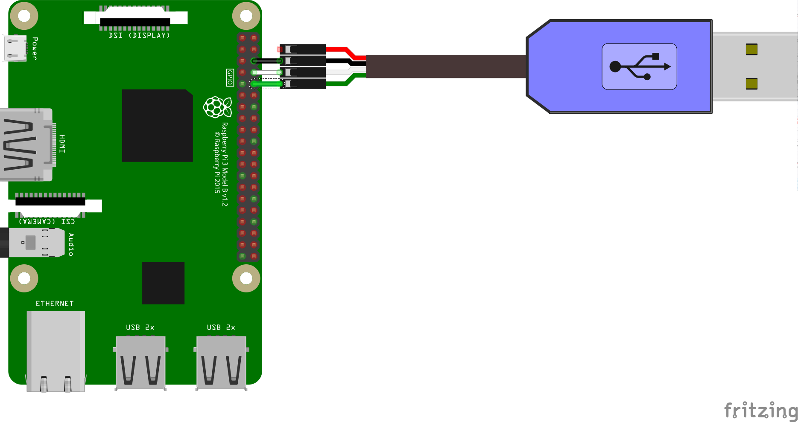

# UART Loopback (Java)

This sample demonstrates basic data read and write operations over a UART.
The application creates a loopback interface that immediately echoes
any data read from the receive (RX) buffer to the transmit (TX) buffer.

## Screenshots

![UART Loopback sample demo][demo-gif]

[(Watch the demo on YouTube)][demo-yt]

## Pre-requisites

- Android Things compatible board with an available UART port
- Android Studio 2.2+
- [FTDI TTL-232R](http://www.ftdichip.com/Products/Cables/USBTTLSerial.htm)
or compatible USB-TTL converter

## Schematics



NOTE: Raspberry Pi 3 shares the UART pins between multiple ports, including the serial debugging
console. Refer to the [mode matrix][pi3-modes] for more details.

Check in the USB TTL cable's documentation for the TX and RX wire colors:
- connect the cable TX wire to the board RX pin
- connect the cable RX wire to the board TX pin

## Build and install

1. On Android Studio, click on the "Run" button.

If you prefer to run on the command line, type

```bash
./gradlew installDebug
adb shell am start com.example.androidthings.loopback/.LoopbackActivity
```

2. Plug the USB-TTL converter into a host PC, start your favorite terminal
program (minicom, screen, RealTerm, etc.), and connect to the USB-TTL port
at 115200 baud.

3. Type characters into the terminal and observe them echo back to you from the device.

## Enable auto-launch behavior

This sample app is currently configured to launch only when deployed from your
development machine. To enable the main activity to launch automatically on boot,
add the following `intent-filter` to the app's manifest file:

```xml
<activity ...>

    <intent-filter>
        <action android:name="android.intent.action.MAIN"/>
        <category android:name="android.intent.category.HOME"/>
        <category android:name="android.intent.category.DEFAULT"/>
    </intent-filter>

</activity>
```

## License

Copyright 2016 The Android Open Source Project, Inc.

Licensed to the Apache Software Foundation (ASF) under one or more contributor
license agreements.  See the NOTICE file distributed with this work for
additional information regarding copyright ownership.  The ASF licenses this
file to you under the Apache License, Version 2.0 (the "License"); you may not
use this file except in compliance with the License.  You may obtain a copy of
the License at

  http://www.apache.org/licenses/LICENSE-2.0

Unless required by applicable law or agreed to in writing, software
distributed under the License is distributed on an "AS IS" BASIS, WITHOUT
WARRANTIES OR CONDITIONS OF ANY KIND, either express or implied.  See the
License for the specific language governing permissions and limitations under
the License.

[pi3-modes]: https://developer.android.com/things/hardware/raspberrypi-mode-matrix.html
[demo-yt]: https://www.youtube.com/watch?v=OBprmZ00T3E&index=12&list=PLWz5rJ2EKKc-GjpNkFe9q3DhE2voJscDT
[demo-gif]: ../demo1.gif
